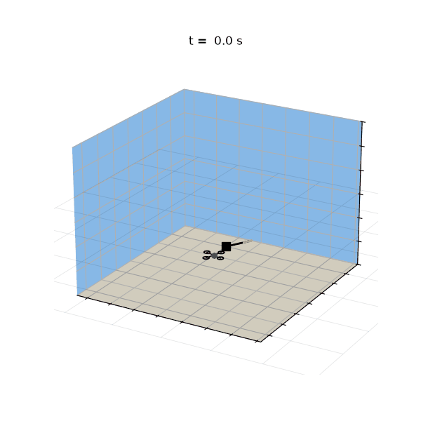
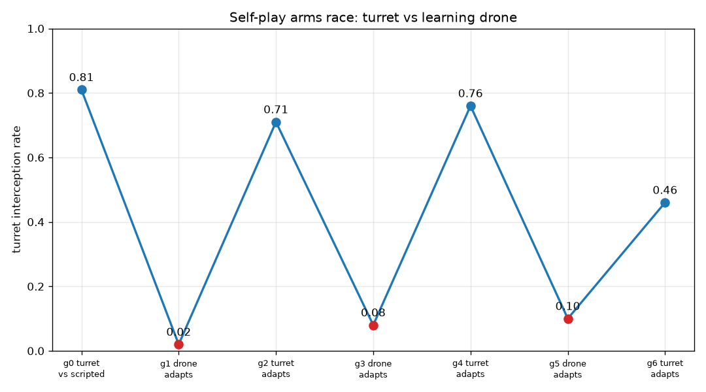
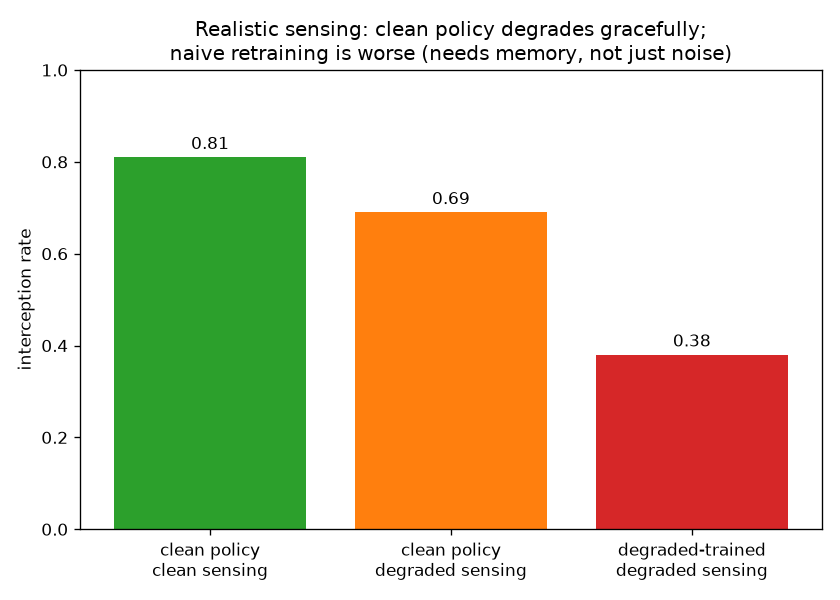
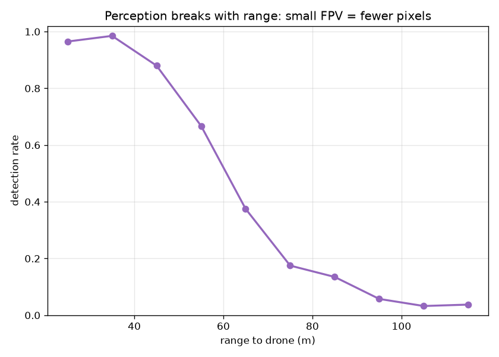
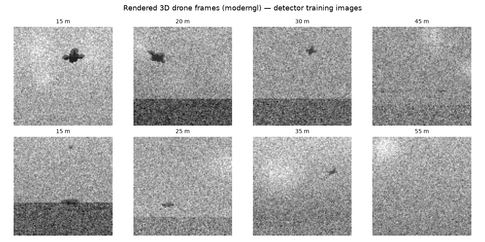
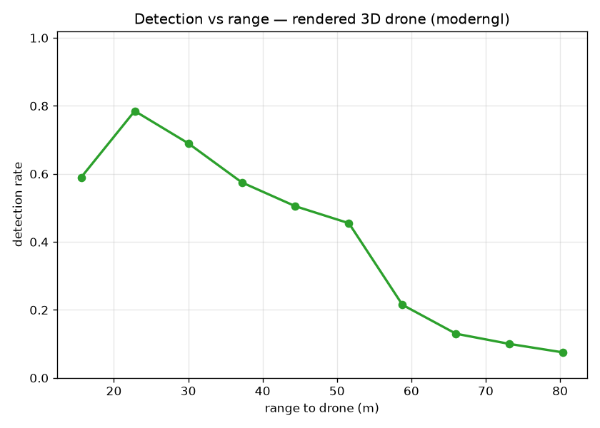
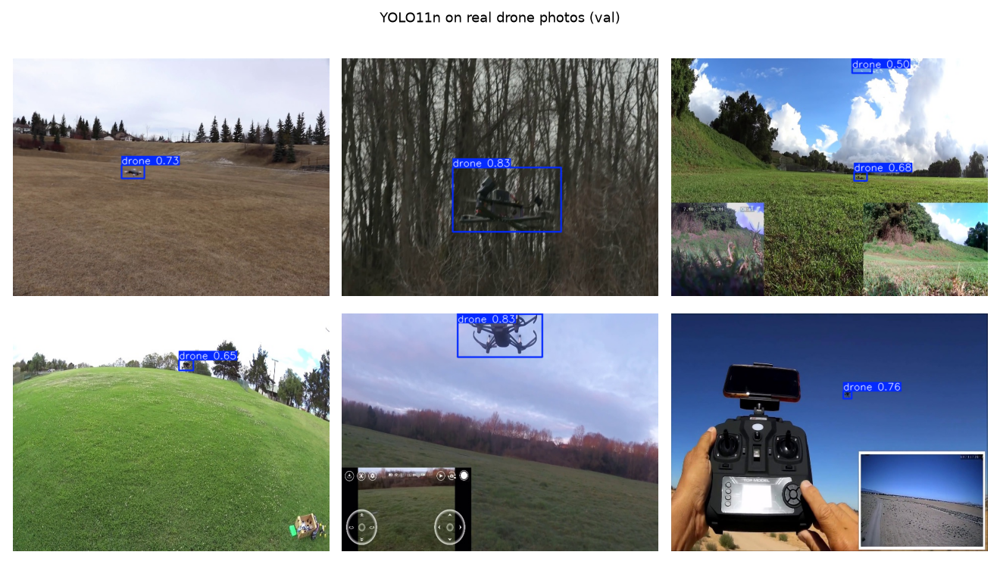
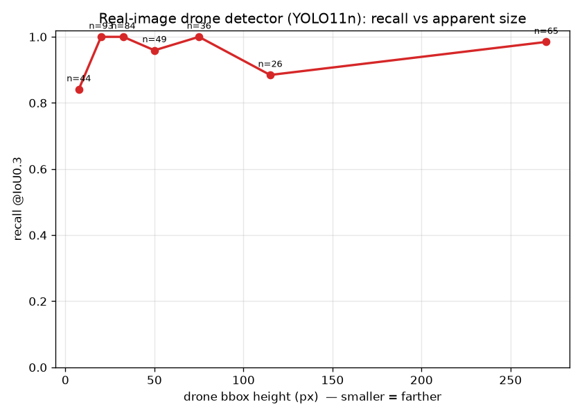

# turret-rl

A 3D counter-FPV simulation where both sides learn. A PPO **turret** learns lead
prediction against an evasive **drone**; the drone learns to evade back via
self-play; and a separate CNN handles the "find the drone in a noisy image"
problem. Fire control and perception are modeled as the *separate stages* they
are in a real counter-UAS system — not fused into one magic pixel-to-action box.



*PPO turret (black, at origin) intercepting an evasive quad. Red = drone trail, orange = projectile tracers. Camera tracks and zooms toward the kill.*

## Results

**Turret vs scripted drone — 82/100 interceptions** (2M steps, ~25 min on one laptop).
It learns to lead a fast, jinking target under noisy sensing, given projectile
flight time, limited slew rate, cooldown, and finite ammo.

**Self-play arms race.** Make the drone its own PPO agent (`DroneEnv`) and
alternate training each side against the frozen other, warm-started from the 82%
turret. The turret's interception rate sawtooths — the drone learns to evade and
collapses it to ~0.02, the turret re-adapts to ~0.75, repeat:



It *oscillates* rather than settling: with deterministic best-response, whoever
adapts last dominates. That's a real property of naive self-play — real systems
damp it with population/league play (a documented next step, not a bug).

**Sensing realism beats graphics — with a twist.** A policy is only as good as
the track it's fed. Under a realistic sensor model — ~300 ms pipeline latency,
range-dependent dropout, range-scaled noise — the clean-trained turret degrades
*gracefully*: **0.81 → 0.69**. Counterintuitively, a turret trained *directly on*
that degraded sensor did **worse (0.38)**: heavy dropout + latency turn it into a
partially-observed problem a memoryless MLP can't crack, so 2M steps of noisier
signal produced a weaker policy. Robustness here came from clean training
generalizing — *not* from "training on noise." Getting a win from degraded-sensor
training would need memory (frame-stacking / RNN) or a clean→degraded curriculum.
That's a real experimental result, reported as it came out:



**Perception breaks with range.** The turret consumes a *track*, not pixels — the
"find the drone" problem is a separate CNN detector trained on domain-randomized
synthetic frames (sky, ground band, clouds, noise, dark distractors). Detection is
near-perfect up close (0.96–0.98 at 25–45 m) and collapses past ~65 m as the drone
shrinks toward a single low-contrast pixel and sinks into clutter:



**Closing the loop is where it gets honest.** Wiring the detector in as the turret's
actual sensor (`DetectorSensor`: render → CNN → back-projected bearing + rangefinder
range → track) drops the 82% policy to **0.12** (vs 0.78 on ground-truth). The cause
is diagnostic, not a bug: the detector's usable range (~65 m) is *far shorter than the
120–180 m engagement*, so the barrel-slaved camera is blind for most of the approach,
and a policy trained on full-state info can't recover in the ~2 s terminal window once
the drone finally becomes visible. That *looked* like a fundamental limit — perception
dominates, you can't bolt a realistic sensor onto an idealized policy for free. **It
wasn't.** Swapping the toy CNN for a real detector (see "A strong detector nearly closes
the loop" below) recovers almost all of it, so the 0.12 was the *weak detector + 64 px
frames*, not the range geometry. Left standing and corrected below, because that reversal
is the most useful thing in the repo. (`python sim.py perception`)

**Realistic rendering (moderngl).** The detector above trains on procedural blobs;
`render3d.py` upgrades that to a real lit **3D quadcopter** rendered in the *same*
pinhole projection, composited over the domain-randomized backgrounds — so apparent
size falls off with true perspective (no hand-tuned blob) and the label comes straight
from `project()`. Up close the four-arm silhouette is legible; by ~45 m the drone sinks
into sensor noise:



Trained on 16k of these frames, detection peaks **~0.79 near 25 m** and collapses past
~60 m as the drone drops toward a couple of pixels in clutter (the dip at the closest
bin is the large near-silhouette clipping frame edges — a real artifact, left in):



This is the honest reading of "train the model on realistic images": the realism that
matters is a perspective-correct 3D object + varied backgrounds + a physical range
falloff — *not* photorealism. It makes the detector's inputs real; it does **not** change
the closed-loop finding above (that was geometry/range, not fidelity). Runs headless via
`moderngl.create_standalone_context()` — no display needed.

**Real-image detector (YOLO on real photos).** The synthetic and 3D-rendered detectors
prove the pipeline works; this proves it survives real imagery. `yolo_real.py` fine-tunes
a pretrained **YOLO11n** on 2625 real drone photographs (the public
`pathikg/drone-detection-dataset` from Hugging Face, converted COCO→YOLO) on the GPU.
On 375 held-out images: **mAP@50 0.974, precision 0.965, recall 0.947.**



Measuring the same thing the synthetic curve does — recall vs apparent size — tells an
honest, *opposite* story: the real pretrained detector barely degrades, holding **0.84
recall even on ~8 px drones** and ~1.0 through the mid-range:



That contrast **is** the finding. The from-scratch tiny CNN on synthetic frames collapsed
past ~60 m; a strong pretrained detector on real photos does not. So "perception breaks
with range" is a property of *that toy detector + synthetic data*, not a law of the
problem — a real off-the-shelf model is far more capable. (Caveat: the flat curve also
reflects this dataset's size distribution and that its "small" drones are still fairly
visible; a genuine long-range/low-contrast set would push it back down.) This detector is
standalone — real photos don't share the sim's engagement geometry — so it complements the
in-loop synthetic detector rather than replacing it.

**A strong detector nearly closes the loop.** So is closing the loop actually hard? I
wired the *real-photo YOLO* (above) straight into the sensor slot (`loop_yolo.py`,
`YoloSensor`) — rendering the sim's barrel-slaved view at 640 px and letting YOLO detect.
Two findings, both against my prior:

- **No domain gap.** The real-photo detector fires on the moderngl sim frames at **0.97**
  with zero sim-specific retraining — a dark quad against sky/ground reads as a drone to
  it, so the real detector needs no bridge to drive the sim.
- **Closed-loop hit rate 0.74** — vs the tiny-CNN's 0.12 and ground-truth's 0.78. A strong
  detector at adequate resolution nearly closes the sim-to-track gap.

So the earlier 0.12 "perception dominates" story was measuring a *weak detector*, not a
hard problem: a capable off-the-shelf model, no retrain, recovers ~95% of ground-truth
control. (Confound, stated: the YOLO sensor renders at 640 px vs the tiny CNN's 64 px, so
it's detector *and* resolution — but the takeaway, that a real detector suffices, holds
either way.) `python loop_yolo.py loop`

## How the stages fit

```
camera frame  ->  CNN detector  ->  track (pos, vel)  ->  PPO fire control  ->  shot
                  (detect.py)       degraded sensor        (sim.py)
```

This decomposition is why an abstract sim is legitimate: the controller never
sees pixels even in a real deployment, so prettier graphics would not change the
policy — only a more realistic *observation model* would. Realism lives in the
sensor, not the render.

## Run

```
pip install gymnasium stable-baselines3 matplotlib torch moderngl
python sim.py test               # physics + both env contracts
python sim.py train [steps]      # turret vs scripted drone -> turret_ppo.zip
python sim.py eval               # interception rate over 100 episodes
python sim.py watch              # render an episode -> episode.gif
python sim.py selfplay [rounds]  # arms race -> selfplay.png
python sim.py degrade [steps]    # perfect-vs-degraded-sensing benchmark -> degrade.png
python sim.py perception         # detector-in-the-loop hit rate (image -> track -> policy)
python detect.py                 # train blob detector -> detection.png + detector.pt
python detect.py 3d              # train on moderngl 3D frames -> sample3d.png + detection3d.png
python render3d.py test          # 3D renderer: projection-match + size-falloff checks
python yolo_real.py prepare      # real HF dataset (parquet) -> yolo_ds/ YOLO format
python yolo_real.py train [ep]   # fine-tune yolo11n on real photos (GPU) -> runs/
python yolo_real.py curve        # recall-vs-size + sample predictions on real data
```

The real-image detector needs `pip install ultralytics pyarrow`, a CUDA torch, and
`realdata/test.parquet` (~275 MB, `pathikg/drone-detection-dataset` on Hugging Face).

## Scope & non-goals

Deliberate boundaries, stated up front:

- **The controller is state-based, not pixel-trained.** End-to-end pixel RL for
  fire control won't converge on commodity hardware (rendering in the training
  loop drops throughput ~100×) and isn't how real systems work — the controller
  consumes tracks. Images live in the detector stage. That's the correct
  architecture, not a shortcut.
- **No Unreal/AirSim photorealism.** The detector trains on moderngl-rendered 3D
  frames (real perspective + domain randomization) — the realism that matters for
  detection. Photoreal rendering wouldn't change the policy, and the sim's demo
  renderer is a stylized matplotlib view on purpose.
- **Physics is point-mass**, not rotor-level 6-DOF — it captures the target
  motion envelope the turret cares about, not blade aerodynamics.
- **The real YOLO detector is both standalone and wired into the loop** (`yolo_real.py`
  mAP@50 0.974; `loop_yolo.py` closed-loop 0.74). No domain bridge was needed — it
  generalizes to the sim's rendered frames as-is. What's still open: a genuine long-range /
  low-contrast regime (where even YOLO would degrade), and fusing a longer-range sensor for
  the blind early approach.
